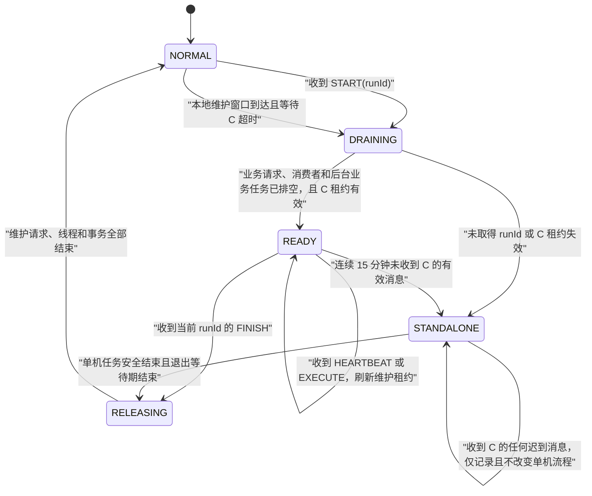
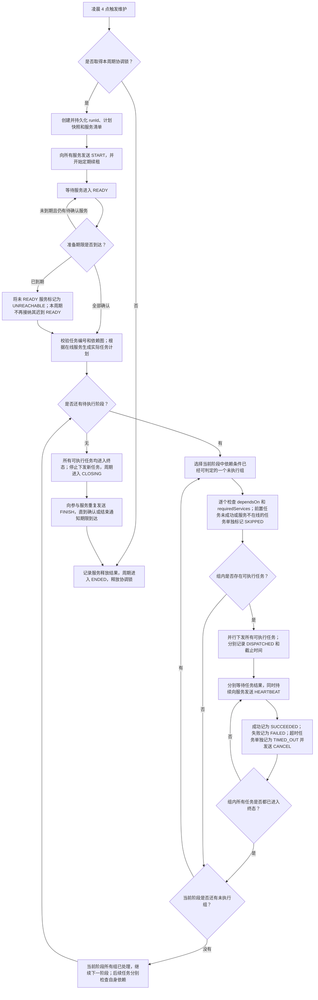
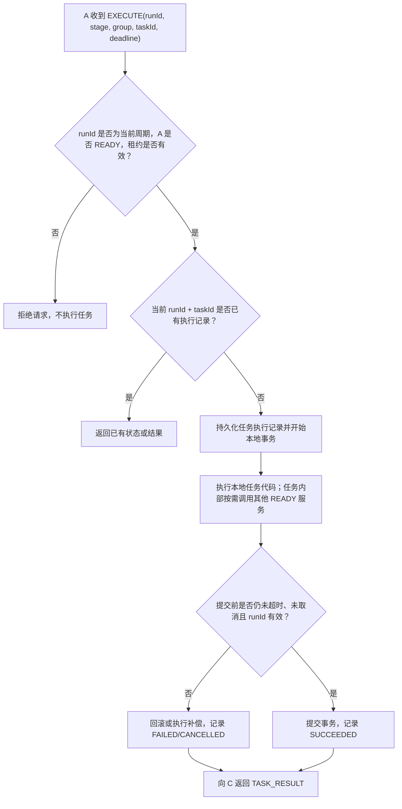
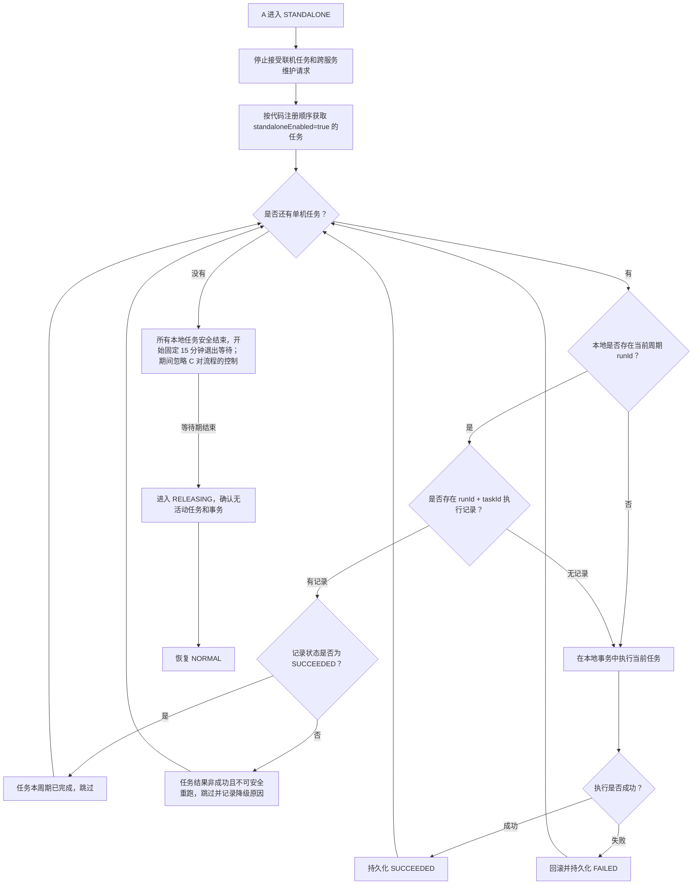

# 分布式系统维护协调设计

## 1. 设计目标

本设计用于协调多个后端服务在每日凌晨维护窗口内停止业务请求、执行本地或跨服务维护任务，并在协调服务不可用时安全降级为单机维护。

系统中的角色如下：

- **协调服务 C**：维护规则的唯一调度者，负责创建维护周期、确认参与服务、按阶段和互斥组下发任务、维持维护租约，以及结束维护。
- **业务服务 A、B 等**：停止和恢复本服务的业务请求，执行本地已注册的维护代码，并在任务内部按需调用其他服务的维护接口。
- **维护任务**：提前编写并部署在目标服务中。C 只下发任务编号和执行上下文，不下发可执行代码，也不需要理解任务内部的跨服务调用链。

设计遵循以下原则：

1. C 是联机维护计划、服务参与状态和任务结果的唯一权威来源。
2. 服务进入维护后只拦截业务接口，协调接口和维护任务接口保持可用并进行独立鉴权。
3. 服务在整个联机维护执行期间保持 `READY`，不再设置 `RUNNING` 或 `COMPLETED` 服务状态。
4. C 根据维护计划中的任务是否全部进入终态决定何时结束维护，而不是等待服务上报完成状态。
5. 阶段表达整体调度顺序，任务的实际前置条件由 `dependsOn` 显式声明；阶段内的组表达并发互斥；同一组内的任务允许并行。
6. 跨服务任务只配置所需在线服务，不在 C 中描述调用链；调用过程由目标服务中的任务代码负责。
7. C 通过维护租约持续证明自己仍在工作。服务长时间收不到 C 的有效消息时进入单机维护，避免永久停留在维护状态。
8. 所有联机命令和执行记录都关联唯一 `runId`，防止重复、迟到或跨周期请求干扰当前维护。

## 2. 核心标识和术语

### 2.1 runId

`runId` 是 C 为一次维护周期生成的全局唯一标识。本文统一使用 `runId`。

示例：

```text
2026-08-16-04-00-2f48c6c8
```

所有联机维护命令、任务执行记录、状态上报和结束通知都必须携带 `runId`。服务只接受当前维护周期的命令，拒绝旧周期的迟到请求。

### 2.2 维护租约

C 在维护期间定期向所有参与服务发送心跳，延长当前 `runId` 的维护租约。服务判断 C 是否失联时，应判断是否超过租约期限，而不是判断是否长时间没有收到新任务。

以下有效消息均可刷新服务本地保存的租约期限：

- `START`
- `HEARTBEAT`
- `EXECUTE`
- `CANCEL`
- `FINISH`

建议默认配置：

- C 每 60 秒发送一次心跳；
- 服务连续 15 分钟未收到 C 的任何有效消息，判定维护租约失效。

### 2.3 在线服务

任务配置中的“服务在线”不是指 IP 和端口能够连接，而是同时满足：

1. 服务属于当前 `runId`；
2. 服务已经进入 `READY`；
3. 服务最近一次心跳或状态更新时间未超过期限；
4. 服务没有进入单机维护或释放流程。

## 3. 状态模型

### 3.1 A 等业务服务的本地状态

| 状态 | 含义 |
| --- | --- |
| `NORMAL` | 正常接收业务请求，不接收维护任务 |
| `DRAINING` | 已阻止新的业务请求，正在等待既有业务请求、消息消费和业务后台任务结束 |
| `READY` | 已排空业务处理，可以执行 C 下发的任务，也可以接收其他服务在当前维护任务中的内部调用 |
| `STANDALONE` | C 未能建立或维持联机协调，本服务只执行允许单机运行的本地维护任务 |
| `RELEASING` | 已停止接收新的维护任务，正在等待活动维护请求、线程和事务安全结束 |

`UNREACHABLE` 只作为 C 对某个服务的观察结果，不作为服务本地状态。服务可能仍然运行，但已经被 C 排除在本周期的联机计划之外。

### 3.2 C 的维护周期阶段

| 阶段 | 含义 |
| --- | --- |
| `CREATED` | 已生成 `runId` 并持久化本次执行计划 |
| `PREPARING` | 已发送维护开始通知，正在等待服务进入 `READY` |
| `EXECUTING` | 正在按阶段和组下发任务 |
| `CLOSING` | 计划已结束，正在通知服务释放维护状态 |
| `ENDED` | 本次维护周期结束 |

C 还应单独记录本次维护的结果等级：

- `SUCCESS`：所有计划任务成功；
- `DEGRADED`：部分服务不可达，相关任务被跳过；
- `FAILED`：存在明确失败或超时的任务，但不影响无依赖关系的其他任务继续调度；
- `ABORTED`：维护周期在开始执行前被管理员或系统终止。

### 3.3 任务状态

| 状态 | 含义 |
| --- | --- |
| `PENDING` | 尚未下发，正在等待其阶段和组获得执行机会 |
| `DISPATCHED` | C 已向目标服务下发任务并等待结果 |
| `SUCCEEDED` | 目标服务明确返回成功 |
| `FAILED` | 目标服务明确返回失败，并已完成本地回滚或补偿 |
| `TIMED_OUT` | C 等待超过配置期限，不再等待或重新执行该任务 |
| `CANCELLED` | 因维护周期被整体终止，或任务自身超时后完成安全取消 |
| `SKIPPED` | 所需服务不在线，或 `dependsOn` 中至少一个前置任务未成功，因此没有下发 |

`SUCCEEDED`、`FAILED`、`TIMED_OUT`、`CANCELLED` 和 `SKIPPED` 都是任务终态。

## 4. A 的状态转移图



状态转换约束：

1. `DRAINING`、`READY`、`STANDALONE` 和 `RELEASING` 均拒绝普通业务请求。
2. C 的协调接口在所有状态下保持可用，但必须验证调用方和 `runId`。
3. C 下发的维护任务只允许在 `READY` 状态执行。
4. 跨服务维护接口只允许在 `READY` 状态执行，并验证调用服务、`runId` 和所属任务。
5. 服务进入 `STANDALONE` 后，不再接受当前 `runId` 的新联机任务，即使 C 后续恢复也不能重新加入当前执行计划；C 的 `HEARTBEAT`、`EXECUTE`、`CANCEL` 和 `FINISH` 均不能打断任务或改变单机退出时间。
6. `READY` 服务收到 `FINISH` 后进入 `RELEASING`；租约失效的服务则进入 `STANDALONE` 并完整执行单机流程。两种路径都不能在维护线程或事务尚未结束时恢复业务。

## 5. 维护计划配置样例

```yaml
maintenance:
  heartbeatIntervalSeconds: 60
  leaseTimeoutSeconds: 900
  prepareTimeoutSeconds: 900
  standaloneExitDelaySeconds: 900

  plan:
    version: 1
    stages:
      - stage: 1
        groups:
          - group: group-a
            tasks:
              - taskId: 101
                targetService: saas-backend
                dependsOn: []
                requiredServices:
                  - saas-backend
                timeoutSeconds: 300

              - taskId: 102
                targetService: insurance-backend
                dependsOn: []
                requiredServices:
                  - insurance-backend
                timeoutSeconds: 600

          - group: group-b
            tasks:
              - taskId: 103
                targetService: saas-backend
                dependsOn:
                  - 101
                requiredServices:
                  - saas-backend
                  - insurance-backend
                timeoutSeconds: 600

      - stage: 2
        groups:
          - group: group-a
            tasks:
              - taskId: 201
                targetService: insurance-backend
                dependsOn:
                  - 103
                requiredServices:
                  - insurance-backend
                timeoutSeconds: 900
```

配置字段说明：

| 字段 | 说明 |
| --- | --- |
| `stage` | 阶段编号，C 按编号顺序执行；后一阶段依赖前一阶段成功结束 |
| `group` | 同一阶段内的互斥执行组；不同组不能并行，但组间没有业务先后要求 |
| `taskId` | 目标服务本地预先注册的任务编号 |
| `targetService` | C 将任务执行指令发送给哪个服务 |
| `dependsOn` | 当前任务依赖的前置任务编号；只有全部前置任务为 `SUCCEEDED` 时才允许执行 |
| `requiredServices` | 任务开始前必须处于当前周期 `READY` 的服务集合 |
| `timeoutSeconds` | C 等待任务结果的最大时长 |

配置规则：

1. 阶段严格串行，但阶段本身不再承担失败传播；任务是否可以执行由 `dependsOn` 决定。
2. 同一阶段中的组严格串行。没有依赖关系时组之间没有业务顺序要求；存在跨组依赖时，C 优先选择前置任务所在组，并持久化本次实际顺序。
3. 同一组内的任务允许并行，配置人员必须保证它们互相兼容。
4. 只有并发冲突、但执行先后不影响结果的任务，应放入同一阶段的不同组。
5. 如果任务存在结果依赖，必须通过 `dependsOn` 明确配置。存在直接或间接依赖关系的任务不能放在同一组，因为同组任务会并行下发。
6. `dependsOn` 可以引用更早阶段或同一阶段更早执行组中的任务；C 启动维护前必须检查任务编号存在性和依赖环，发现循环依赖时拒绝启动维护。
7. `requiredServices` 多于一个时即为多服务任务，无需额外设置 `multiService`。
8. C 只检查 `requiredServices` 是否在线，不保存任务内部的调用链。

服务本地还需要用代码注册单机执行顺序。单机任务不需要重复配置完整的联机计划，可以通过代码中的注册顺序和 `standaloneEnabled` 标记确定：

```java
register(101, true, this::maintainEnterpriseSubscriptions);
register(102, false, this::synchronizeCrossServiceData);
register(201, true, this::archiveLocalDeletedData);
```

上例表示任务 `101`、`201` 可以单机执行，任务 `102` 涉及其他服务，只能由 C 在联机模式下调度。

## 6. C 的完整执行流程



### 6.1 准备阶段

1. C 取得本维护周期的分布式协调锁，避免多实例重复发起维护。
2. C 创建全局唯一 `runId`，将维护计划快照、服务清单和开始时间持久化。
3. C 向所有服务发送 `START(runId)`，随后定期发送 `HEARTBEAT(runId)`。
4. 服务进入 `DRAINING`，阻止新业务请求，并等待既有请求、消息消费者和业务后台任务结束。
5. 服务排空后进入 `READY` 并上报 C。
6. 准备期限内未进入 `READY` 的服务被 C 标记为 `UNREACHABLE`。本周期执行计划确定后，其迟到的 `READY` 不再生效。

### 6.2 阶段和组调度

1. C 按阶段编号从小到大执行。
2. C 在一个阶段内一次只执行一个组，不允许不同组并行。
3. 没有依赖关系时，组的业务顺序没有要求；存在跨组依赖时，C 必须先选择包含前置任务的组。C 应持久化实际组顺序，保证重启恢复后不会改变。
4. C 分别检查组内每个任务的 `dependsOn`。只有所有前置任务均为 `SUCCEEDED` 时任务才满足依赖；任一前置任务为 `FAILED`、`TIMED_OUT`、`CANCELLED` 或 `SKIPPED` 时，当前任务标记为 `SKIPPED`。
5. 依赖满足后，C 再检查任务的 `requiredServices`。任一必需服务不在线时，只将对应任务标记为 `SKIPPED`，不影响同组其他可执行任务。
6. 同一组内满足条件的任务由 C 并行下发到各自的 `targetService`。
7. 目标服务执行预先注册的任务代码。跨服务调用由任务内部完成，C 不解析调用链。
8. C 等待组内所有任务分别进入终态后选择下一个组。某项任务被跳过、失败或超时，不会打断同组其他任务，也不会阻止其他组和后续阶段执行。
9. 当前阶段所有组处理完毕后，C 无论阶段内是否存在失败或跳过的任务，都会进入下一阶段；下一阶段中的每个任务根据自己的 `dependsOn` 独立决定执行或跳过。

### 6.3 任务失败和超时

为了保持配置简单，采用统一的安全策略：

1. 目标服务明确返回失败时，任务标记为 `FAILED`。
2. C 等待超过 `timeoutSeconds` 时，任务标记为 `TIMED_OUT`，不再重试或重新下发。
3. C 只向超时任务的目标服务发送取消请求，不取消同组其他任务。同组任务相互兼容，应各自执行到成功、失败或自己的超时时间到达。
4. C 继续执行当前阶段的其他组和后续阶段。只有显式依赖失败、超时或跳过任务的下游任务会被标记为 `SKIPPED`，无依赖关系的任务不受影响。
5. 服务执行任务时必须在事务提交前检查截止时间、取消标记和当前 `runId`。检查失败则回滚。
6. 超时只代表 C 不再等待该任务，不能证明任务从未提交。如果任务已提交但响应丢失，应记录迟到结果并通过任务自身的幂等或补偿逻辑处理。
7. C 进入结束流程前，应给取消中的任务保留安全退出时间；服务也必须在本地确认维护线程和事务已经终止后才恢复业务。

### 6.4 结束阶段

1. 所有计划任务成功，或者某任务失败导致后续计划终止后，C 进入 `CLOSING`。
2. C 停止下发新任务，并向参与服务发送 `FINISH(runId)`。
3. 仍参与联机协调且处于 `READY` 的服务进入 `RELEASING`，拒绝新的维护任务，等待活动维护请求、线程和事务结束；已经进入 `STANDALONE` 的服务忽略该通知对流程的控制，继续独立执行。
4. 服务恢复业务并向 C 上报释放结果。
5. C 在通知期限内重复发送 `FINISH`，记录未确认释放的服务，随后结束本周期并释放协调锁。

## 7. A 的联机任务执行流程



任务幂等记录至少使用以下联合标识：

```text
runId + taskId
```

如果未来允许同一任务在一个周期中执行多次，应增加由 C 生成的 `executionId`，使用：

```text
runId + taskId + executionId
```

## 8. 单机维护执行逻辑

### 8.1 进入单机模式的条件

A 在以下两种情况下进入 `STANDALONE`：

1. **存在当前周期 `runId`**：A 收到过 C 的 `START`，但在 `DRAINING` 或 `READY` 阶段连续 15 分钟没有收到 C 的任何有效消息，维护租约失效。
2. **不存在当前周期 `runId`**：A 的本地凌晨维护窗口已经到达，但在准备等待期限内始终没有收到 C 的 `START`。此时 A 自行排空业务请求并进入单机维护。

进入 `STANDALONE` 后：

- 拒绝 C 新下发的联机任务；
- 不调用其他服务；
- 只执行代码中标记为允许单机执行的任务；
- 按服务本地注册代码的先后顺序串行执行；
- 本地任务全部安全结束后才开始计算单机退出等待时间。

### 8.2 单机任务去重规则

如果 A 本地存在当前周期的 `runId`，说明此前可能已经在 C 的调度下执行过部分任务。A 按代码顺序遍历单机任务时，对每个任务执行：

1. 查询 `runId + taskId` 的本地执行记录；
2. 如果状态为 `SUCCEEDED`，说明本周期已经完成该任务，直接跳过；
3. 如果状态为 `FAILED`、`CANCELLED` 或 `TIMED_OUT`，不得直接假定可以重跑；默认跳过并记录单机降级结果，避免重复产生副作用；
4. 如果没有记录，执行该任务；
5. 执行成功后持久化 `SUCCEEDED`，使服务重启后仍能跳过已完成任务。

如果 A 本地不存在当前周期的 `runId`，则无法与 C 的任务记录关联，A 按本地代码注册顺序依次执行所有允许单机执行的任务。为便于审计，A 可以生成仅在本地使用的 `localExecutionId`，但它不等同于 C 的 `runId`，也不能凭此重新加入联机维护。

### 8.3 单机执行流程图



### 8.4 单机模式下收到 C 消息

1. 一旦进入 `STANDALONE`，A 就完全脱离当前周期的联机协调，并按照自己的任务顺序和退出计时完成整个单机流程。
2. 收到当前 `runId` 的 `HEARTBEAT`、`EXECUTE` 或 `CANCEL` 时，A 拒绝请求并返回“本服务已进入单机维护，本周期不能重新加入”。
3. 收到当前 `runId` 的 `FINISH` 时，A 只记录审计日志和返回当前单机状态，不中断正在执行的任务，也不缩短任务完成后的固定退出等待时间。
4. 如果收到其他 `runId` 的迟到消息，直接拒绝并记录审计日志。
5. 如果本地不存在 C 的 `runId`，任何迟到的 `START` 都不能中断已经开始的单机任务；C 应将 A 视为本周期不可达。

## 9. 接口开放规则

| 接口类型 | `NORMAL` | `DRAINING` | `READY` | `STANDALONE` | `RELEASING` |
| --- | ---: | ---: | ---: | ---: | ---: |
| `START/HEARTBEAT/FINISH/STATUS` 协调接口 | 是 | 是 | 是 | 是 | 是 |
| C 下发的任务执行接口 | 否 | 否 | 是 | 否 | 否 |
| 其他服务调用的维护接口 | 否 | 否 | 是 | 否 | 否 |
| 普通业务接口 | 是 | 否 | 否 | 否 | 否 |

维护接口必须满足：

- 使用精确路径白名单绕过业务维护拦截，不能放行全部内部接口；
- 使用内部密钥、请求签名或双向 TLS 鉴权；
- 不计入正在排空的业务请求数，但计入独立的活动维护请求数；
- 校验 `runId`、调用服务、任务编号和截止时间；
- 对任务执行和跨服务调用保存审计记录；
- 重复请求必须幂等。

## 10. 持久化和恢复要求

C 至少持久化：

- `runId`、计划版本、周期阶段和结果等级；
- 本次维护的服务清单、服务状态和最后心跳时间；
- 阶段、组及其本周期实际执行顺序；
- 每个任务的目标服务、必需服务、状态、开始时间、截止时间和结果；
- C 的协调锁或主节点租约。

A、B 等服务至少持久化：

- 当前 `runId` 和本地维护状态；
- C 的最后有效消息时间和租约期限；
- `runId + taskId` 的任务执行结果；
- 活动维护任务的开始时间、事务或取消状态；
- 单机任务执行结果和恢复业务时间。

服务重启后不能直接默认为 `NORMAL`。如果持久化记录显示上次停留在维护周期中，应先尝试查询 C；无法联系 C 时，按照租约和单机维护规则恢复。

## 11. 关键安全约束

1. 超时表示 C 不再等待和重试，不表示任务一定没有修改数据。
2. 所有任务必须支持幂等，或提供明确的本地回滚、跨服务补偿方案。
3. 任务事务提交前必须重新检查截止时间、取消状态和 `runId`。
4. 服务不能在仍有维护线程、活动维护请求或未结束事务时恢复业务。
5. C 判断参与服务是否在线，只依赖当前周期的 `READY` 和有效心跳，不依赖普通端口探测。
6. 服务进入单机维护后，本周期不能重新加入 C 的联机计划。
7. 单机模式只允许操作本服务负责的数据库和资源，禁止执行跨服务、跨数据库任务。
8. 如果同一阶段中的两个任务执行顺序会影响最终结果，它们必须放入不同阶段；组只能表达并发互斥，不能表达结果依赖。

## 12. 最终流程摘要

正常情况下：

```text
C 创建 runId
→ 服务排空业务并进入 READY
→ C 持续续租
→ C 按阶段顺序执行
→ 每个阶段按组串行执行
→ 每个组内任务并行执行
→ 所有任务结束或计划因失败终止
→ C 发送 FINISH
→ 服务安全释放并恢复业务
```

C 失联时：

```text
服务维护租约超过 15 分钟未续期
→ 进入 STANDALONE
→ 按代码顺序遍历允许单机执行的任务
→ 有 runId 时跳过本周期已成功任务
→ 无 runId 时依次执行全部允许单机执行的任务
→ 本地任务安全结束
→ 固定等待 15 分钟，期间 C 的 FINISH 只记录、不干预
→ 确认无活动维护工作
→ 恢复业务
```
